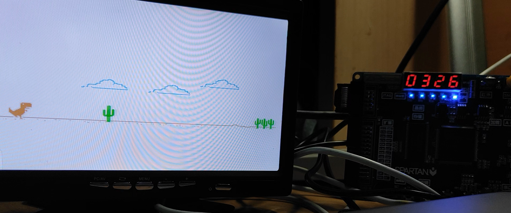

# ZJU-LCDF-FPGA-Dino

This repo is a ZJU Logic and Computer Design Fundamentals Course Project of 2021 Autumn-Winter Semester, featuring an enhanced Chrome Dino game clone. The project uses Verilog HDL to implement the game on SWORD FPGA board (based on Xilinx Kintex-7 series), but can be easily ported to other FPGA boards. 

Picture below is the game ported to a cheap board called Espier 3, based on outdated Xilinx Spartan-6 series. Picture taken in dorm. 

To directly build it, you must install outdated Xilinx ISE 14.7. ISE would work under Windows 10 with minor patches, but won't work under Windows 11 yet. 

The code is well-documented (at least in my sense). Enjoy! 

## File List

- doc: contains both document source (Markdown and LaTeX) and binary (PDF and images)
- img: images used in the game project
- ipcore_dir: IP ROM cores to store image data
- *.v: source Verilog code with comments
- misc file: just rubbish generated by ISE, but whether they are safe to delete is unknown
