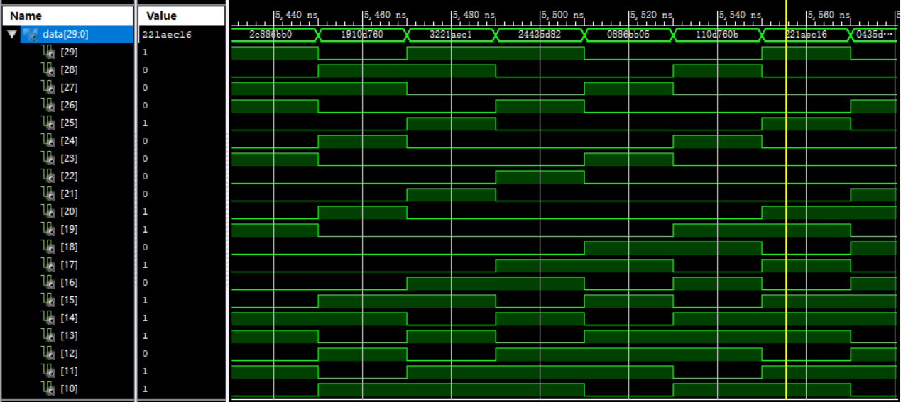

# 项目背景

## 游戏简介

小恐龙游戏是 Google Chrome 浏览器内置的一个小游戏，在计算机离线的时候，按下空格键即可激活小恐龙游戏，以此来消磨无聊的离线时间。如下图所示，图片来自网络，因为我并不使用 Chrome 浏览器。游戏中的小恐龙是一只孤独的霸王龙（T-Rex）。用户还可以通过地址栏输入`chrome://dino`来调出小恐龙游戏。该游戏是 Google 在 2014 年开发的，由于 Chrome 系列浏览器的流行，小恐龙游戏也广为人知。据 2018 年的调查，该游戏每月被玩 2.7 亿次。


游戏规则十分简单：小恐龙会一直向前跑，玩家通过按空格或上键跳跃、按下键蹲下来避开沿途的仙人掌和翼龙，分数逐渐增加，小恐龙的速度也逐渐增加。如果小恐龙碰到任何障碍物，游戏就会结束，需要按下重置按钮或空格键即可重新开始。游戏结束界面如下图所示，原游戏还会记录历史最高得分（HI）和当前得分，还有夜间模式增加难度，以及简单的音效来增强交互体验。


在网络上也能找到不少在线翻版游戏[^1]，可供没有安装 Chrome 浏览器的用户体验。在 Microsoft Edge 也改用 Chromium 内核后，Microsoft 也推出了与小恐龙相当的滑雪游戏，从一维改成了二维，也可通过`edge://surf`访问。

## 选题原因

由于我对于 FPGA 开发了解不多，而且只有一个人独立完成，根据设计要求，首先就把项目类型限定在游戏上。迷宫、俄罗斯方块、贪吃蛇等游戏显得比较传统，而且个人也不擅长玩。而小恐龙游戏原版有一定难度，也十分有趣，实现也较为简单，在本项目中也可以降低难度以减少挫败感。

## 项目内容

本项目的目标是在 FPGA 上实现一个模仿原版小恐龙的游戏，支持**彩色 VGA 输出**、**PS/2 键盘输入**和**蜂鸣器音效输出**。在游戏功能上，六种仙人掌、三种不同高度的翼龙会随机出现阻碍小恐龙，玩家可以操纵小恐龙跳跃或蹲下来躲避。游戏的细节也增加了真实感，比如小恐龙和翼龙都有简单的运动动画，地面有随机的坑洼，而天空中也会随机漂浮最多四片云朵。游戏分数与小恐龙跑过的距离成正比，最高可达 9999（~~不会有人玩到 10000 分吧~~），在 SWORD 板的八位数码管上恰好可以显示**历史最高得分和当前得分**。另外，小恐龙也会**动态加速**，而**黑夜也会周期性降临**，干扰玩家的视线。


此外，随着我逐步完成游戏开发，逐渐体会到了硬件编程的乐趣，最终购买了自己的 FPGA 开发板。我很快将小恐龙游戏移植到了这块基于 Spartan-6 的 Espier 3 上。关于它的详细信息将在下一章中展开。


## 本文结构

# 项目架构概述

## 游戏规则与设定

游戏启动后，处于冻结状态，按任意键即可开始游戏。当一局结束后，显示`GAME OVER`，按任意键可以重新开始。为了方便玩家，不仅可以通过方向键控制小恐龙，也可以用 ASDW 或 JKLI 控制，并且保留了原游戏中**空格键等价于向上键**的习惯。其中向上键控制小恐龙跳跃，不过没有实现跳跃力度控制，因此每次小恐龙跳跃的初速度是恒定的，而且其运动符合自由落体规律。当小恐龙不在跳跃过程中时，向下键控制小恐龙蹲下以躲避翼龙。实际上**蹲下是不必要的**，所有障碍物都可以通过跳跃来避开，但可以增加游戏复杂度。另外在跳跃过程中，**按下键无法提高下落速度**，因为所谓的“加速下落”是违反物理规律的，因此不予实现。

障碍物分为**仙人掌**和**翼龙**（尽管长得很像鸟）两类，只要小恐龙任意位置碰到障碍物即为失败。其中仙人掌有两种大小，大型、小型仙人掌又有单个、两个和三个（大型为四个）三种变体，颜色都是绿色的。而翼龙只有一种，但其高度有三种，最高的翼龙正常跑不蹲下也可以避开，中间高度的翼龙蹲下可以避开，最低的翼龙无法通过蹲下避开。而**所有障碍物都可以通过恰当的跳跃来躲避**。

当小恐龙跳起时、死亡时都有对应的音效，而分数每次满 100 也有音效提示，这样玩家即使不看分数显示也能大概知道。音效都来自原始游戏。分数显示在数码管上。在特定的时候，会出现昼夜切换，但**只有背景颜色会动画反色**，其他物体的颜色都不变，这一点与原始游戏都反色不同。此外夜间的时长远少于日间。

在 SWORD 板上，打开 SW0 可以开启作弊（调试）模式，小恐龙会悬浮在空中，不受跳跃和障碍物的影响。在 Espier 3 上暂时未实现。

## 设备介绍

作为“数字逻辑设计”的课程设计项目，本项目在 FPGA 上开发，使用课程介绍的 Xilinx ISE 14.7 及 Verilog HDL 开发。FPGA 介于 ASIC 和通用芯片之间，通过可编程功能，可以实现各种复杂的数字逻辑，应用于芯片原型设计、异构计算加速等。目前 FPGA 的主要生产厂商是 Xilinx（AMD 计划收购）和 Altera（Intel 收购），两家旗鼓相当，各有千秋，但是 Xilinx 市场占有率更高些，而且课程使用的 SWORD 开发板和 ISE 软件都是 Xilinx 系的。为了方便开发，我在考虑购买自己的开发板时也首选 Xilinx。此外，校内流行的自购开发板 Nexys 系列基于的也是 Xilinx Artix-7 系列。

7-系列以前的 FPGA 只能使用 ISE 开发，而 ISE 在新系统下兼容性差。在 Windows 10 下需要进行补丁才能使用，在 Windows 11 下暂时无法使用。

### SWORD

课程使用的 SWORD 开发板基于 Xilinx Kintex-7 系列，核心芯片 XC7K160T 可提供高达 160K 逻辑单元。Kintex-7 是 7-系列芯片的中端版本，而高端芯片为 Virtex-7，低端芯片即上文提到的 Artix-7，此外还有 Spartan-7。Xilinx 官网介绍，7-系列均采用 28nm 工艺。

在本项目中使用到的资源包括

- 100 MHz 时钟
- 12 位色（RGB444）VGA 接口及板载小型 VGA 显示器（也可以使用外接 VGA 显示器）
- USB 转 PS/2 键盘接口
- 板载无源蜂鸣器
- 板载 8 位静态数码管
- Arduino 板载 8 个 LED 灯供调试
- 板载开关

开发板还有很多有待使用的资源，如闪存可以在断电后保存设计，板级 SRAM 和 DRAM 能提供比分布式 RAM 和 BRAM 更多的空间，还有现代的 HDMI 接口、以太网接口、通用 USB 接口等。在之后的课程中可以发挥更多的作用。

### Espier 3

相比之下，我购买的 Espier 3 是廉价、过时的入门级开发板，基于 Spartan-6 系列，是 7-系列的上一代，与实验手册上介绍的曾经使用过的 Spartan-3 隶属同一个入门级 Spartan 系列。其核心芯片 XC6SLX9 包含约 9K 逻辑单元，不过在购买前我就用 ISE 测试过，完全可以实现本项目。Spartan-6 采用 45nm 工艺。


由于该开发板较小，包含的资源也**相当有限**，在本项目中可以使用到的包括

- 48 MHz 时钟
- 16 位色（RGB565）VGA 接口（需要外接 VGA 显示器）
- 原生 PS/2 键盘接口
- 板载无源蜂鸣器
- 板载 4 位动态扫描数码管
- 板载 4 个按钮


通过扩展引脚和适当的扩展板，应该外置一些额外资源，但有待探索。这套开发板最大的优势是价格低廉，自行采购全套设备（包括外接显示器、键盘、下载器等）不到 500 元，其中开发板仅 211 元。开发板相关资料较为详细，但是使用的芯片都比较过时，可能存在驱动问题。将来或许可以推广作为入门级开发套装，省去来回跑实验室的时间。


## 关键技术

### VGA 接口


VGA 显示器需要 5 个信号来显示图像，其中 RGB 为模拟信号，表示三种颜色的深度，开发板上的数字信号通过简单的电阻 D/A 转换生成；而 HS 和 VS 为水平和垂直同步信号，用于进行行同步和帧同步。


如上图所示，在每一帧内，并不是全部时间都能用于输出，而是存在**过冲**和**同步信号**预留的时间，只有中间区域可以真正用于显示。这是由于早期显示器采用的是阴极射线管（CRT），通过电子束扫描来显示图像。由于惯性的存在，电子束在行切换、帧切换时的移动需要一定的时间，这段时间是不能显示任何内容的，这就是所谓的前过冲（Front Porch）和后过冲（Back Porch）。“过冲”一词形象地描绘了电子束由于惯性冲出显示区域外的情形。而同步信号用于控制每行、每帧的时间，形式是**负脉冲**，即平时为高电平，当同步时转变为低电平。

关于 VGA 信号的具体时序，是有明确规定的。当分辨率、帧率不同时，对应的过冲和同步脉冲时间不同，使用的像素时钟也有所不同。时序不能随意设置，否则可能无法正常显示。在网络上可以找到相关资料。[^2]尽管现代的显示器已经不再使用 CRT，为了兼容性，VGA 的时序仍然保持不变。开发者只需要按照规定即可实现视频输出。本项目采用的是 VGA 的原始标准，是所有显示器都应当支持的兼容模式，即 640x480@60Hz，像素时钟为 25.175 MHz。SWORD 板时钟进行两次分频，Espier 3 板时钟进行一次分频，可以近似达到这一时钟，存在的误差可以不计。

### PS/2 接口


如上图所示，PS/2 接口共有 6 个引脚，其中 2 号、6 号引脚是保留的，4 号、3 号分别为 VCC、GND，1 号引脚用于串行传输数据，5 号引脚为时钟信号。


PS/2 设备使用简单的串行通信协议进行双向同步通信。但在本项目开发中，只关心键盘向开发板的通信。如图所示，时钟信号为**负边沿触发**，平时不进行通信时时钟信号保持为高电平。每次通信传输 1 个起始位（总为 0）、8 个数据位、1 个奇校验位和 1 个停止位（总为 1）。


PS/2 键盘用扫描码来描述按键按下、释放的事件，有一套复杂的规则。[^3]其中按键释放时会发送 F0 扫描码，再加上对应按键的扫描码。按键对应扫描码可以参见上图。

### IP 核与图像转换

在本项目中需要显示各种物体的图像，尽管可以通过 Verilog 代码直接生成内存，但使用 IP 存储核更加方便通用。而使用板载的闪存和 RAM 较为复杂，理论上也是可行的。使用 ISE 可以创建两种 IP 存储核，分别是分布式存储器和块存储器，前者是异步访问，后者是同步访问（需要时钟），但后者可以使用核心芯片中的块存储器（BRAM），能够创建更大的存储器。因此，在本项目中使用 BRAM 存储核，而且由于图像不需要更改，生成的 IP 核类型为 ROM。

ROM IP 核可以采用 coe 文件初始化，这是一种文本文件，格式如下：

```text
memory_initialization_radix=16;
memory_initialization_vector=12,34,56,78,AB,DA,CC,FF;
```

这个例子描述了一个 8x8 的 ROM 初始化数据，其中逗号间隔的就是一个字长。文件可以随意换行，本项目中为了方便观察，在图像的每行结尾换行。

为了将 PNG、JPG 等格式的图片转换为 coe，我选择了使用 Python 脚本，Python 的 PIL 库进行图像处理比较方便。在一些学习和尝试后，我使用以下脚本进行转换：

```python
from PIL import Image
im=Image.open('image.png')
(width,height)=im.size
px=im.load()
with open('image.coe','w') as f:
    print('memory_initialization_radix=2;',file=f)
    print('memory_initialization_vector=',file=f)
    for y in range(0,height,2):
        for x in range(0,width,2):
            if px[x,y]==(247,247,247,255):
                print('01',end=',',file=f)
            elif px[x,y]==(83,83,83,255):
                print('10',end=',',file=f)
            else:
                print('00',end=',',file=f)
        print('',file=f)
```

注意到上述脚本还对图像进行了 50% 缩放处理。由于原始游戏是黑白的，颜色非常少，小恐龙、仙人掌和翼龙只有 3 种不同的颜色（背景=00、前景=10、白色边缘=01），而云朵和地面甚至没有白色边缘，只有 2 种颜色。因此我创建的 ROM 的字长为 2 位或 1 位，极大节省了空间，使项目在低端开发板上也能顺利实现。保存背景像素也为后期图层重叠、透明显示提供了帮助。

### 碰撞检测与图层控制

有了图像数据，如何真正输出游戏界面呢？由于之前学过 x86 汇编下的显示方式，是通过写显存（VRAM）完成的，而显存直接映射到屏幕上对应的像素。然而，在本项目中如果使用 VRAM，不但浪费资源且不现实，而且难以实现碰撞检测和图层控制。学习了成熟的项目后，了解到应当使用基于像素扫描的碰撞检测与图层控制，不创建显式 VRAM。

这一思想相当简单，即显示模块在 VGA 扫描到图像区域内时，输出图像对应位置那个像素的数据，如果不在区域内则输出空白。而多个显示模块可以负责不同的图像输出，上层模块通过判断各个模块输出的像素数据，来完成碰撞检测和图层控制。例如，当小恐龙显示模块和障碍物显示模块同时输出非空像素时，说明小恐龙撞到了障碍物，此时应当启动游戏结束的逻辑。同时，GAME OVER 图像应当显示在最顶端，覆盖所有其他内容，这只要通过优先显示该模块的像素就能实现。这样就能完成类似 Photoshop 中的图层控制。

### 蜂鸣器接口 {#buzzer}

在一系列失败的尝试后（详见[开发调试过程](#debug)一章），我发现蜂鸣器的接口非常简单。在 SWORD 和 Espier 3 上都有无源蜂鸣器，只有一个信号输入。直接用所需频率的方波驱动蜂鸣器即可发出对应频率的声音，不过音色有待改善。

为了获取游戏音效的具体数据，我采用了对原游戏音效录音，使用 Audacity 分析波形的方式完成。通过物理实验中的方法，选取多个波形，计算平均周期即可测得其频率，再测得时长即获得了单个音调的数据。而一个音效由一个或多个音调组成，中间也可能有空白。数据整理如下（T 表示一个周期）：

| 音效类型 | 音效组成 |
| -------- | -------- |
| 小恐龙跳跃 | 514 Hz，19 T |
| 分数满百分 | 514 Hz，40.5 T；767 Hz，171 T（原音效淡出无法实现） |
| 游戏结束 | 64 Hz，2.5 T；空白，2 T（64 Hz）；64 Hz，5 T |

: 表格标题

## 游戏模块架构

游戏包含以下模块：

- VGA 显示模块：用上层模块产生的像素输出对应的 VGA 信号
- PS/2 键盘模块：接收键盘按键扫描码，输出当前按键状态
- 物体控制模块：控制障碍物、小恐龙、云朵、地面在屏幕上的位置
- 物体显示模块：在对应位置显示物体像素（包含动画），传递给 VGA 模块
- 蜂鸣器音效模块：控制音效生成，并输出到蜂鸣器
- 辅助模块：包含随机数生成、BCD 加法器、游戏时钟等
- 顶层模块：实现上述模块互联，以及分数显示、碰撞检测、游戏状态控制、昼夜切换等简单功能

# 模块设计与实现

## VGA 显示模块

### 输入

- d_in：要显示的像素数据，RGB444 格式
- vga_clk：VGA 时钟，大约 25 MHz
- clrn：复位信号

### 输出

- row_addr,col_addr：显示区域内的相对行数、列数，上层模块用这两个数据生成 d_in
- r,g,b：直接输出到 VGA 的像素数据
- rdn：当前正在读像素数据，低电平有效
- hs,vs：直接输出到 VGA 的同步信号

VGA 显示为通用模块，本着不造轮子的思想，直接使用了课件中的 VGA 模块。VGA 模块可以分为两个部分，一部分维护水平和垂直计数器，记录当前的行数和列数，当一行结束时才会更新行计数器；另一部分在 VGA 时钟正边沿更新对应的 R,G,B,HS,VS 信号，同时输出当前的行数和列数，以便上层模块提供对应的像素数据。另外需要注意的是，只有在中间区域才能置 R,G,B，其他区域 R,G,B 必须置 0。

### 仿真

对 VGA 模块进行仿真需要较长的仿真时间，才能看到过冲、同步等事件。仿真代码输入恒定像素，提供 VGA 时钟，观察仿真结果。


如图所示，rdn 为低电平时模块读取像素数据，row_addr 和 col_addr 是实际显示区域相对位置。当 row_addr 为 -35 和 -34，即每一帧的前两行时，垂直同步低电平有效。


在 row_addr 为非负数时，rdn 周期性有效，表示读取一行的像素。而 rdn 脉冲比水平同步脉冲窄的区域即为前后过冲。


进一步放大波形，观察 col_addr 变为非负数时，rdn 有效，R,G,B 数据开始传输。

## PS/2 键盘模块

### 输入

- clk：开发板的时钟信号
- ps2_clk, ps2_data：直接来自 PS/2 接口的串行信号

### 输出

- key：当前按下按键的编码

PS/2 模块代码也来自课件。模块在检测到 PS/2 时钟负边沿时启动采样，在每次通信完成、数据奇偶校验无误后，将数据放入 FIFO 循环队列，不过在本项目中并不需要队列，因为数据会立刻被读取，因此读取信号 rdn 一直置为 0。

PS/2 模块没有进行仿真，因为其仿真较为复杂，在开发板上用 LED 输出扫描码，发现工作正常即可。

之后构建高层键盘控制模块 MyKeyboard，直接忽略功能扩展码 0xe0，并且对释放码 0xf0 进行了判断，当识别到释放码时将当前按下的键清空，否则就把扫描码认为是当前按下的键。由于在游戏中仅需要用到向上、向下键，使用 2 位编码当前按下的键。

| 当前按键编码 | 意义 | 对应实际按键 |
| ------------ | ---- | ------------ |
| 00           | 无按键按下 | 无按键 |
| 01           | 向上键按下 | 向上键、空格键、W 键或 I 键 |
| 10           | 向下键按下 | 向下键、S 键或 K 键 |
| 11           | 其他任意键按下 | 其他任意键 |

## 物体控制模块

### 障碍物控制模块

#### 输入

- clk：VGA 时钟，为了与显示模块一致
- game_clk：游戏时钟信号，用于障碍物移动
- rst：复位信号
- over：游戏结束信号
- minEmpty：两个障碍物间至少要有多少像素，与游戏时钟频率成反比

#### 输出

- obstacle1~3：包含三个障碍物槽是否有效、类型和水平位置信息
- score：当前分数

障碍物控制模块是游戏的核心逻辑，需要实时生成、维护障碍物的各种信息。本模块依赖随机数生成模块和 BCD 加法器模块。早期为了游戏设计方便，本模块还维护当前分数并输出。障碍物控制模块可以分为以下几个部分：

- 根据随机数生成下一个障碍物的类型（由开发板时钟分频信号驱动，在游戏时钟时域完全没有规律，保证了随机性）
- 在确保障碍物间最少像素的前提下，根据下一个障碍物类型，在空闲的障碍物槽中生成下一个障碍物（游戏时钟驱动）
- 在没有障碍物生成时，将所有障碍物左移一个像素，实现小恐龙相对右移（游戏时钟驱动）
- 根据 20 像素 = 1 分，更新游戏得分（游戏时钟驱动）

#### 仿真

为了仿真方便，将一些参数改小。障碍物间最少 10 像素，遇到“无”类型（0000）障碍物等价 5 个空白像素，新障碍物从 30 像素处出现。


如图，在复位完成后，首先 1 号障碍物槽填入障碍物类型 0001（小型单个仙人掌），列数从 0x1e（30）开始递减。当列数减到 0x14（20）时，已经满足最小间距，此时的下一个障碍物恰好不是“无”类型的，而是 0111（大型四个仙人掌），填入空闲的 2 号槽，同时 1 号槽内的位置暂停一个周期。


10 个周期之后，当 2 号槽列数减到 20 时，恰好遇到了“无”类型障碍物，等价 5 个空白像素。5 个周期后，下一个障碍物类型为 1011（最高的翼龙），填入空闲的 3 号槽，同时 1、2 号槽暂停一个周期。可见控制的细节逻辑是正确的，下面缩小波形图，观察长时间的波形。


如图，obstacle 显示为密集花纹时表示其正在频繁变化，说明槽有效，正在每个周期向左移动。而其他时刻，槽的低 10 位总为 0，表示槽此时无效，该障碍物不存在。观察波形，可以发现屏幕上可以同时有 0~3 个障碍物存在，随机性较好，满足设计要求，可以获得较好的游戏体验。

### 小恐龙控制模块

早期为了游戏设计方便，本模块是小恐龙显示模块的一部分，不单独存在。本模块的内容较少，主要实现了小恐龙跳跃控制。注意到**小恐龙下落的规律与其水平方向的运动速度无关**，所以需要单独创建时钟分频，而不能使用统一的游戏时钟。

小恐龙跳跃的控制很简单，由于小恐龙在较短时间内近似匀速运动，采用定时更新速度、位移的方式来实现物理引擎。在每个时刻根据游戏状态和按键情况，决定是否开始跳跃，设定跳跃初速度方向向上。在跳跃过程中，更新速度、垂直位移信息。还要处理的特殊情况包括：

- 跳跃过程中，若小恐龙死亡，应当停止跳跃，但**保持其位置不变**，以便玩家观察失败的原因
- 若发生复位，小恐龙应回到地面上
- 若玩家开启作弊（调试）模式，小恐龙会悬浮在空中，不受跳跃和障碍物的影响

由于没有单独模块，故无法完成仿真。

### 云朵控制模块

#### 输入

- clk：VGA 时钟，为了与显示模块一致
- rst：复位信号
- over：游戏结束信号

#### 输出

- cloud1~4：包含四个云朵槽是否有效、云朵垂直偏移和水平位置信息

云朵控制模块的逻辑由障碍物控制模块简化而来，除了增加了数量和云朵垂直偏移以增加随机性外，其他都很类似，这里就不赘述了。值得注意的是，云朵移动速度应当与小恐龙的速度无关，是恒定的，因此采用了单独的时钟分频设计。

### 地面控制模块

本模块也不单独存在，而是地面显示模块的一部分，逻辑也较为简单，主要实现了两种地面（有坑洼和无坑洼）的随机切换。为了简化游戏和节省资源，游戏中的**地面总是有两部分拼接而成**，两部分可能是同种路面，也可能是不同种的。本模块控制两部分的分界线，当分界线来到屏幕最左边时，意味着左边部分路面显示完成，此时需要生成新的右边路面类型，并把原先的右边路面改成左边。

## 物体显示模块

### 障碍物显示模块

#### 输入

- clk：VGA 时钟，用于像素生成
- game_clk：游戏时钟信号，用于翼龙飞行动画
- rst：复位信号，实际上是游戏结束信号
- obstacle：控制模块生成的**一个**障碍物信息
- row,col：来自 VGA 显示模块，当前扫描的位置

#### 输出

- d_out：当前位置的像素，用于碰撞检测和图层控制

障碍物类型编码与图像对应如下：

| 类型编码 | 障碍物类型 | 实际图像 |
| -------- | ---------- | -------- |
| 0        | “无”类型   | 53x0 空白 |
| 1        | 小型单个仙人掌 |  |
| 2        | 小型两个仙人掌 |  |
| 3        | 小型三个仙人掌 |  |
| 5        | 大型单个仙人掌 |  |
| 6        | 大型两个仙人掌 |  |
| 7        | 大型四个仙人掌 |  |
| 9        | 低空翼龙   |  |
| 10       | 中空翼龙   |  |
| 11       | 高空翼龙   |  |

本模块代码较长，但基本都是重复的，逻辑由两部分组成：一部分为 IP ROM 核实例化，用于获取图像像素信息；另一部分为实际显示逻辑，当扫描位置位于当前障碍物内，并且当前障碍物有效时，向对应的 ROM 提供像素位置，并读取对应 ROM 的像素数据。由于 ROM 中的颜色只有 2 位，还需要根据障碍物类型转换为 12 位颜色。

另外，由于 ROM 需要 1 个周期才能完成读取，因此到下一个像素才能读取本像素的数据，需要做一些处理。本模块还需要根据游戏时钟，生成翼龙飞行的动画，只需要在没有复位的时候，交替显示翼龙翅膀在上面和下面的图片即可。

### 小恐龙显示模块

#### 输入

- clk：VGA 时钟，用于像素生成
- game_clk：游戏时钟信号，用于小恐龙奔跑动画
- rst：复位信号
- over：游戏结束信号
- cheat：开启作弊（调试）模式
- row,col：来自 VGA 显示模块，当前扫描的位置
- key：当前按下按键的编码

#### 输出

- d_out：当前位置的像素，用于碰撞检测和图层控制
- jumping：小恐龙是否正在跳跃

小恐龙具有以下几种状态：

| 小恐龙状态 | 实际图片 |
| ---------- | -------- |
| 正在跳跃 |  |
| 奔跑迈出左脚 |  |
| 奔跑迈出右脚 |  |
| 蹲下奔跑迈出左脚 |  |
| 蹲下奔跑迈出右脚 |  |
| 死亡 |  |

本模块与障碍物显示模块类似，但情况更加复杂些。首先需要同时准备好当前像素正常奔跑和蹲下奔跑的区域和像素，再通过各种信号来确定应当输出什么。对于正常奔跑类型，信号优先级从高到低如下：

1. 若不在正常奔跑图像区域内，显示空白；否则
2. 若游戏结束，显示小恐龙死亡图像；否则
3. 若小恐龙正在跳跃（不可能蹲下），显示小恐龙跳跃图像；否则
4. 若小恐龙正蹲下，显示空白；否则
5. 根据游戏时钟分频，显示左右脚交替动画。

相比之下，蹲下奔跑类型较为简单，只需区分当前是否蹲下，显示动画即可。最后，由于空白像素为 12'hfff，将两个像素算术与输出。当然，之前需要完成像素数据转换。

### 云朵显示模块

> 本模块与障碍物显示模块基本一致，不再赘述。


### 地面显示模块

#### 输入

- clk：VGA 时钟，用于像素生成
- game_clk：游戏时钟信号，用于地面移动
- rst：复位信号
- over：游戏结束信号
- row,col：来自 VGA 显示模块，当前扫描的位置

#### 输出

- d_out：当前位置的像素，用于碰撞检测和图层控制


本模块也上述模块较为类似，不过需要根据当前位置和分界线位置的关系，判断当前位置属于左边部分还是右边部分，并计算对应 ROM 中的像素地址。

### 游戏结束界面显示模块

> 与上述模块类似，不再赘述。


## 蜂鸣器音效模块

### 输入

- clk：开发板的时钟信号
- rst：复位信号
- jumping：小恐龙是否正在跳跃
- milestone：分数是否正好满百分
- over：游戏结束信号

### 输出

- buzzer：蜂鸣器驱动信号

在本模块中，创建了低层声音模块，用于产生**一种频率的方波信号**，同时输出已经产生的方波（半波）数量。利用开发板的时钟信号，只需要简单计数判断就能产生任意低频率方波。而模块采用**同步复位信号**，来清空计数器和方波数量。

本模块逻辑上可以分为以下部分：

- 三种频率的方波模块实例化
- 使用标准状态机实现声音控制，通过当前音效状态和已经产生的方波数量，确定下一状态
- 在 jumping,milestone,over **信号正边沿**，为状态机提供外部输入以进入音效状态
- 根据状态机当前状态，确定蜂鸣器输出信号

状态如下表所示（状态关系较为简单，不再绘制状态图）：

| 编号 | 状态含义 | 转移条件 |
| ---- | -------- | -------- |
| 0    | 静音     | 在 jumping,milestone,over 信号正边沿进入非 0 状态 |
| 1    | 跳跃音效 | 输出 19 个 514 Hz 方波后回到状态 0 |
| 2    | 满百音效第一部分 | 输出 40.5 个 514 Hz 方波后转到状态 3 |
| 3    | 满百音效第二部分 | 输出 171 个 767 Hz 方波后回到状态 0 |
| 4    | 死亡音效第一部分 | 输出 2.5 个 64 Hz 方波后转到状态 5 |
| 5    | 死亡音效静音部分 | 等待 2 个 64 Hz 方波后转到状态 6 |
| 6    | 死亡音效第二部分 | 输出 5 个 64 Hz 方波后回到状态 0 |
| 7    | 无效状态 | N/A |

## 辅助模块

### 随机数生成模块

输入为开发板时钟信号，输出为 30 位（伪）随机数。

采用了网络上找到的斐波那契线性反馈移位寄存器（LSFR）[^4]，30 位的循环节可以长达上千万，具有较好的随机性。其核心思想就是将寄存器移位后，填入由原先若干位异或后得到的位。移位寄存器的初始值与循环节长度相关，本模块选用了文章中推荐的 30'h20000029。

#### 仿真



可以看出，尽管从位上看有一定的规律，从整体的数值大小上看基本可以认为是随机的。

### BCD 加法器模块

输入为两个 4 位 BCD 数 a,b，输出为 4 位 BCD 数 c=a+b。

游戏中需要显示 4 位十进制分数，用 BCD 加法器实现分数累加比较方便。当然后来发现可以直接用常用的整除取模方法，将二进制数据转换为十进制。BCD 加法器与二进制加法器基本一致，4 位 BCD 加法器可以由 4 个 1 位 BCD 加法器行波进位连接而成。而 1 位 BCD 加法器只需要对二进制加法作 BCD 调整即可，具体来说就是当和大于 9 时加上 6，强制加法跳过 A..F。

#### 仿真


可以发现，c=a+b 都是正确的，并且最高位的进位会直接丢弃。这意味着如果玩家得分超过 9999，则会折回到 0 重新开始。

### 游戏时钟模块

#### 输入

- clk：开发板的时钟信号
- rst：复位信号

#### 输出

- clk_out：游戏时钟信号
- minEmpty：两个障碍物间至少要有多少像素，与游戏时钟频率成反比

游戏时钟通过两层计数器实现，当低层计数器到达上限时即产生半个游戏时钟信号，而产生 1500 个游戏时钟信号后，将降低低层计数器的上限，从而提高游戏时钟频率。同时，本模块还维护了两个障碍物间最少的像素数，用于障碍物控制模块。值得注意的是，当处于复位状态时，将游戏时钟信号频率**提高到开发板时钟信号**，以确保**游戏时钟信号驱动的模块也能顺利复位**。

由于游戏时钟频率较低，不容易仿真，这里也跳过仿真。

## 顶层模块

除了连接上述各模块之外，早期为了开发方便，顶层模块还具有其他功能。

### 游戏状态控制

游戏状态由 over,rst,froze,released 四个信号控制，作用如下：

- over：游戏结束信号，由碰撞检测产生
- rst：复位信号，在游戏结束界面用户按任意键进行复位
- froze：游戏加载完成后冻结，用户按任意键取消冻结开始游戏
- released：用来记录按键是否释放

不同的信号组合含义及状态转移如下：

| over | rst | froze | released | 含义 |
| ---- | ----| ----- | -------- | ---- |
| X    | X   | 1     | X        | 游戏尚未开始，此时 over=0,rst=1，一直进行复位 |
| 1    | 0   | 0     | 0        | 碰撞刚检测到，游戏结束，按键尚未释放 |
| 1    | 0   | 0     | 1        | 由上一状态按键释放进入 |
| 0    | 1   | 0     | 0        | 开始复位，由上一状态按任意键进入 |
| 0    | 1   | 0     | 1        | 由上一状态按键释放进入 |
| 0    | 0   | 0     | X        | 游戏正常运行，由上一状态或冻结状态按任意键进入 |

released 信号是辅助信号，如果不设置的话，游戏结束时用户如果还没松开按键，那么会直接进行复位，导致用户看不到游戏失败的原因就重新开始游戏了。released 信号由 key 的状态来更新。

### 分数显示

直接调用课程实验中编写的七段数码管译码器和串并转换模块，将当前分数和历史最高分数显示在 SWORD 板的 8 位静态数码管上。为了分隔两个分数，左数第四个数码管的小数点点亮，其他小数点均不亮。

### 昼夜切换

昼夜切换动画由特定分数触发，而且日间时长大于夜间。由于背景色总是灰色的，即 RGB 值应当相等，切换过程是从 12'hfff（白色）过渡到 12'h000（黑色）或者反过来，因此只需要记录 4 位背景亮度和当前进行的切换类型。而昼夜切换类型其实只有背景亮度递增和递减两种，通过记录切换的目标亮度，只需要 1 位即可记录切换类型。当背景亮度递增或递减到目标值时，就不再变化。切换动画需要单独的时钟分频来驱动，我认为切换速度应该与游戏时钟频率成正比，因此对游戏时钟进行分频。

# 开发调试过程 {#debug}

## 开发日志

> 前期由于疫情原因，开发是在东 4-512 而不是 509 实验室完成的，后期也仍然以 512 开发为主。

### 前期计划

选定了相对简单的小恐龙游戏，思考了 VRAM 实现，感觉难度较大。

### 12 月 11 日

开始写本项目，第一个任务是完成 VGA 输出，先尝试全部像素都输出白色。尽管直接采用了课件中的模块，但理解、调试花了几个小时。一开始的问题是模块复位信号搞反了，导致一直无信号。纠正之后，屏幕显示 OUT OF RANGE 错误，仿真、比较了很久，发现是时钟分频模块写错了，导致 VGA 时钟频率不正确。

### 12 月 12 日

学习了成熟的项目后，我转而选择使用像素扫描而不是 VRAM 来实现显示。从游戏中获取图片，（学习）写 Python 脚本处理图像，再学习如何选择并创建 IP 存储核，最终终于在屏幕上显示出了第一个物体——红色的小恐龙，但是边缘被截掉了一部分。我猜测可能是 ROM 和控制电路的延时导致的，而减小延时较为复杂，一种简单的办法是直接将图片右移一些，成功解决问题，且不影响图像显示。

之后开始设计游戏核心模块——障碍物控制模块，但一开始的设计测试发现障碍物完全不出现。而如果输入固定信号到障碍物显示模块，能正常显示，说明问题出在控制模块中。进一步排查发现是随机数模块存在问题，导致选择的障碍物全部为“空”类型，另外复制粘贴重复代码有的地方没改。为了减少复制粘贴的问题，我发现应该让一个显示模块只显示一个障碍物，由三个模块来处理所有障碍物。

我还发现了下板测试的简单调试方法，就是把**信号输出到 LED**，就能借此判断信号变化是否正常。当然由于 LED 只有 8 位，相当有限，更好的方法可能是用 8 位数码管或 16 位 LED，但那时候还没学串并转换，并不会写驱动模块。当天最终完成了小恐龙和障碍物的显示、障碍物移动控制。

### 12 月 15 日

加入了 PS/2 模块和小恐龙的跳跃控制。一开始我把 PS/2 模块输出直接连到 LED 上，发现 PS/2 模块的复位信号也搞反了，导致按键输出非常奇怪，我甚至一度怀疑课件代码有问题还是键盘有问题。而小恐龙的跳跃控制有些复杂，其中最主要的问题是小恐龙在屏幕上上下“漂移”。借助 LED 调试，发现这是因为小恐龙速度信号的位数小于小恐龙垂直位置信号的位数，由于没有进行符号扩展，小恐龙一直向下移动。

当天成果是游戏核心逻辑基本能运作了，游戏结束界面也已经加入，但是尝试串并转换输出到数码管以失败告终。

### 12 月 16 日

当天在实验室写项目，但很不幸在一次双击综合后，ISE 卡住并最终崩溃了，几秒后 Windows 就蓝屏了！重启之后发现 xise 工程文件被完全破坏，我不得不重新导入所有文件，并等待很久以重新生成所有 IP 核，相当痛苦的经历，之后吓得我经常备份工程文件。

由于下午还有课，又帮忙看了同学实验中的问题，因此工作时间较短，只是把串并转换修好了。

### 12 月 17 日

当天加入了基本所有物体的图像显示和动画效果，包括各种仙人掌和翼龙、云和地面，以及小恐龙奔跑动画、蹲下功能和昼夜切换动画，作弊模式也加入了。由于之前核心模块已经完成，当天难度并不大，只是工作量较大，需要转换许多图片。

当天还试图解决一个一直困扰我的 bug，就是障碍物偶尔会凭空出现，有时甚至会导致同一个位置有两个障碍物，比如翼龙“被困在仙人掌里面”这种奇怪的情况。因此经过了许多失败的尝试，我猜测是障碍物控制和显示模块的某种时序问题导致的，最终的解决方法不是很优雅，每个周期都检查是否有非法的障碍物（可能即将或已经凭空出现的），如果有就移除，并且把控制模块和显示模块的时钟统一为 VGA 时钟。似乎缓解了这个 bug，但可能不彻底。

之后的计划是实现屏幕显示分数和音效模块。

### 12 月 21 日

> 以下直接改编自我当天写下的大段感慨，较为口语化

开始尝试声音输出！首先发现 zju-icicles 的资料里有一个 beep.v，但打不开原始来源，后来发现多半是垃圾 Chrome 把 www 吃掉了的缘故。[^5]

SWORD 基本找不到文档，完全不知道该把 beep.v 里面的输出接什么引脚。首先我试了 PPT 里讲的 buzzer 引脚，发现它和一个 LED 引脚重了，显然是假的。之后我好不容易找到了 sword-all.ucf，发现有两个疑似引脚 AUD_PWM, AUD_SD，我该把 speaker 接哪个呢？显然是 PWM 嘛，那 SD 是个什么东西，是不是要输出一个时钟之类的？网上各种关键词找，如 fpga music 或者 SWORD 那个型号，并没有结果。只接了 PWM 显然毫无用处。

后来我发现搜索 AUD_SD 就能找到了，虽然是 Nexys 的资料，但应该也适用于 Kintex 吧。答案很简单，把 SD 置 1 即可……然而我发现还是没用，然后隐约看到了 3.5 mm 耳机。哦，原来要插上耳机，但还是没用，不过似乎有杂音。我又找了另一份输出警报声的代码[^6] ，居然就成功了，虽然只有单声道，也就是只有右边耳机有声音。

然后我突然看到 Arduino 子板上的蜂鸣器旁边清楚的印着引脚 AF25，和 PPT 上的 AF24 就差了一点点。大概是硬件更新了但 PPT 没改吧。我兴奋的把开关输出到蜂鸣器，发现只有在开关变化的时候蜂鸣器会响一下。那么直接把警报声代码 AUD_PWM 赋给 buzzer 会怎么样呢？结果蜂鸣器一直响。我突然明白了，似乎 AUD_PWM 的输出和 buzzer 不一样，我把最初的 beep.v 输出到了 buzzer，蜂鸣器传来了“优美”的旋律，总算解决了声音输出问题！不过音质真的很烂，甚至比 PC Speaker 还烂。

### 12 月 26 日 ~ 30 日

使用[蜂鸣器接口](#buzzer)中描述的方法，测定了游戏音效的频率和时长。之后几天断断续续的实现了音效模块，并在 30 日测试通过。这段时间开始考虑购买自己的开发板，并在 30 日 ISE 验证了 XC6SLX9 足够实现当前的游戏设计。

### 1 月 6 日

考完马原之后，考试周暂告一个段落，当然后面还有考试。我先用厂家给的程序测试了已经收到的 Espier 3 开发板，探索了串口通信和红外遥控等有趣的功能，不过串口驱动装了挺久才装好能用的旧版本。之后开始移植游戏代码，由于时钟频率不同，一开始忘记调整音效模块的参数，导致声音直接低八度。但最终游戏工作良好，只是缺少显示历史最高分的数码管（数码管只有 4 位）和用于控制作弊模式的开关。

我还尝试了用 bit 文件生成 mcs 文件，然后写入闪存中，这样断电后也不会丢失设计了。每次启动后会自动通过 SPI PROM 对 FPGA 进行编程，直接就能玩小恐龙游戏，非常方便。当然 SWORD 也可以，但我就不破坏原先的闪存数据了，尤其是 512 的 SWORD 闪存中似乎已经有很多好玩的游戏啦。

### 之后几天至今

完成本文档，并拍摄介绍视频。

## 部分 ISE 操作步骤

本节列出部分 ISE 软件操作步骤，对于课程实验中经常使用的常见操作，不予列举以控制篇幅。

### IP 核创建


首先新建一个 IP 核


选择类型为 BRAM（同步存储器，空间更大）或分布式存储器（异步访问）


选择默认的 Native 接口类型即可


将存储器类型改为单端口 ROM，因为图像数据不需要修改


选择适当的字长（Width）和寻址空间（Depth）


选择一个 coe 文件以初始化 ROM，点击 Generate 生成


选中 IP 核，双击 View HDL Instantiation Template 选项，复制模板到代码中即可实例化 IP 核

### 开启多线程

ISE 具有有限的多线程支持，实际效果并不是很明显。


选中顶层模块的 Implement Design 选项，在菜单中选择 Process-Process Properties，在左边窗格选择 Map Properties，确保 Property display level 在 Advanced 级别。将 Enable Multi-threading 选项改为 2，表示使用 2 线程。


同理，在 Place & Route Properties 中将 Enable Multi-threading 选项改为 4，表示使用 4 线程。应用即可。

### 将程序固化到闪存中


在 iMPACT 中选择创建新项目，对话框选择 Yes。


选择 Prepare a PROM File


以 Espier 3 为例，选择 SPI Flash-Configure Single FPGA，下一步


选择并添加适当的闪存容量，单位为位，下一步


选择输出 mcs 文件的名称和路径，接下来在对话框中选择一个 bit 文件


不必添加其他设备文件，之后菜单选择 Operations-Generate File 完成生成

之后在边界扫描的时候，附加 mcs 文件就能完成固化过程。

# 总结与展望

本项目实现了一个较为完善的小恐龙游戏，用户交互支持 VGA 图像输出、PS/2 键盘输入、蜂鸣器音效等，具有丰富多彩的游戏操作、道具装饰，游戏体验较好，可玩性较高。

## 项目收获

本项目的难度比平时实验大很多，遇到了各种问题都只能通过仿真和测试排查，自行寻找资料解决。而由于模块功能复杂、不同模块间存在依赖、运行时间长等原因，仿真的难度较大，很多时候还是靠板上 LED 调试解决问题。问题也可能无法彻底解决，比如上文提到的障碍物随机出现 bug，只是得到了缓解而未能彻底解决。每次修改代码后，都需要重新综合—实现—生成—下载，相比软件编程耗时长很多，而且期间还不能继续修改代码。另外，尽管游戏中用到的图像都比较小，生成 IP 核还是需要好几分钟。

当然，在项目中，我阅读、编写了大量 Verilog 代码，尽管没怎么看文档，但熟悉了 HDL 的基本功能，在后期实验中能够得心应手。一些模块的核心逻辑参考了网络上[^7]或前人的项目，使我有了大致的实现思路，并试图解决这些项目中的缺陷。

而在选购自己的开发板过程中，我了解了 FPGA 核心芯片的生产厂家和主要参数，研究了多种 JTAG 下载线的差异，最终组建完成了我的 FPGA 开发套装。而在项目移植过程中，我的主要参考资料就是卖家提供的各种介绍文档、引脚约束和例程等，想要感叹一句，这个过时的 Espier 3 开发板资料甚至都比我能找到的 SWORD 文档要全面正确不少！希望 SWORD 的文档能整理的更好些。

## 改进方向

本项目的游戏功能还有不少可以改进的地方，例如

- 加入本该完成的屏幕分数显示，使玩家不用分散视线到旁边的数码管来观察得分，这需要创建字符 ROM
- 适当提高游戏难度，如减小障碍物间距、提高小恐龙速度上限等，并允许玩家选择游戏难度
- 为了平衡游戏难度和可玩性，可以设定小恐龙撞到障碍物不是立刻死亡，而是减少生命值
- 进一步可以增加“治疗药物”类道具，玩家可以努力操纵小恐龙碰到空中的药物，来增加生命值
- 加入难度更大的障碍物，例如让翼龙上下移动，增加躲避难度
- 加入背景音乐，并找到同时播放背景音乐和音效的方式

通过一系列改进，可以把简单的小恐龙游戏增强为类似超级马里奥类游戏。

另一方面，项目中的交互接口也可以改进，例如采用更加现代的、数字信号的 HDMI 接口代替过时的、模拟信号的 VGA 接口，用 USB 键盘代替 PS/2 键盘，在 Espier 3 开发板上用红外遥控器代替键盘以增加游戏便携性等。

## 结语

在暑假超算短学期的课程中，老师介绍各种计算设备时用了一个比喻，CPU 就是几个大学生，GPU 是成千上万的小学生，而 FPGA 则是偏科生。FPGA 的优势在于高可定制性和较好的串行执行效率。在“信电导论”中，我已经大概了解了 FPGA 的结构，而老师强调硬件编程和软件编程同样重要，让我对 FPGA 开发充满了好奇。没想到这个学期，在数逻实验中我就能接触到 FPGA 开发了，并最终完成了本项目。尽管由于疫情原因，大程改成了选做，但本项目中的乐趣促使我将其完成。

数逻是为下一步计组等课程学习提供基础的，在本项目中，可以较为自由地编写 Verilog，而不用考虑数字系统的通用性、可扩展性等。而下一步就要迈向微处理器设计，而其上的软件编程反而是我更加熟悉的。以图像显示为例，我经历了从 C 大程的“高层”（与后面的相比属于高层，但其实已经比现代 GUI 开发底层了）图形库编写排序算法可视化，到 x86 汇编直接写显存来访问 VGA 文本模式和图形模式，再到本项目直接实现 VGA 硬件接口电路，从软件逐渐向硬件过渡，了解了各层抽象背后的更多细节，满足了我的好奇心。而接下来的计组、体系结构等课程，又会从硬件自底向上回到软件，真是完美的闭环。

在 1980 年代，IBM PC 由于采用了开放标准和较为先进的技术，迅速成为了 PC 主流标准，使我们在几十年后的今天依然可以学习编写 x86 汇编，理论上能在绝大部分 PC 上运行（当然采用 ARM 的 Mac 和智能手机显然不行）。而与 PC 相伴而生的 VGA[^8]和 PS/2 的广泛使用，使我们在今天依然可以学习编写 VGA 和 PS/2 的接口电路，并能获得对应接口的硬件来测试。但另一方面，技术又在不断进步，现代的 64 位 Windows 已经不再能运行原始的、基于 DOS 的 16 位程序了[^9]，而逐渐普及的仅 UEFI 启动的电脑也使裸机 Legacy 操作系统开发不再可能[^10]。同理，VGA 和 PS/2 也越来越少见，HDMI、USB 乃至蓝牙已经成为主流。

[^1]: 例如<https://chromedino.com/>
[^2]: <http://www.tinyvga.com/vga-timing>
[^3]: <https://wiki.osdev.org/PS/2_Keyboard>
[^4]: <https://stackoverflow.com/questions/14497877/how-to-implement-a-pseudo-hardware-random-number-generator>
[^5]: <https://www.fpga4fun.com/MusicBox4.html>
[^6]: <https://gist.github.com/Wonicon/ccb22563cc7b000d4019>
[^7]: 例如<https://github.com/michael1017/verilog_dino>
[^8]: 好吧，早期还有 MDA、CGA、EGA 等，但 VGA 基本能向下兼容
[^9]: 主要因为 x86 CPU 在 64 位模式下不再支持虚拟 8086（V8086）模式，但是 CPU 复位后仍然会先进入实模式（8086 模式），因此理论上现代 x86 CPU 仍能运行 DOS 和 16 位程序；当然模拟和虚拟化仍能在任意平台上确保 16 位程序运行
[^10]: UEFI 中的设备驱动通常为原生 64 位代码（也有 32 位的），不再保留 16 位 BIOS 的中断调用